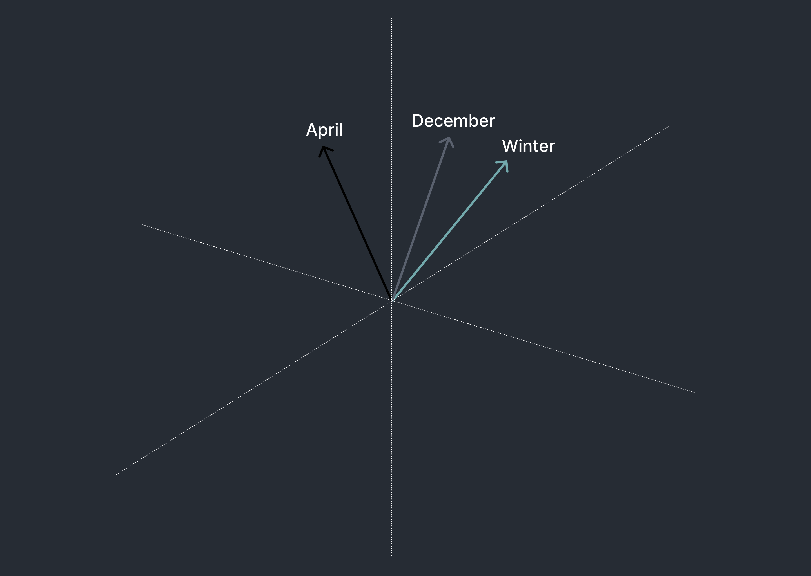
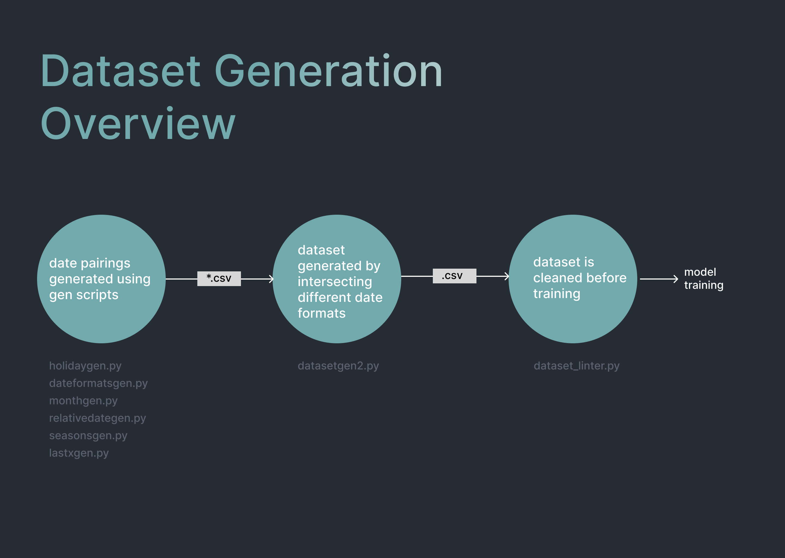
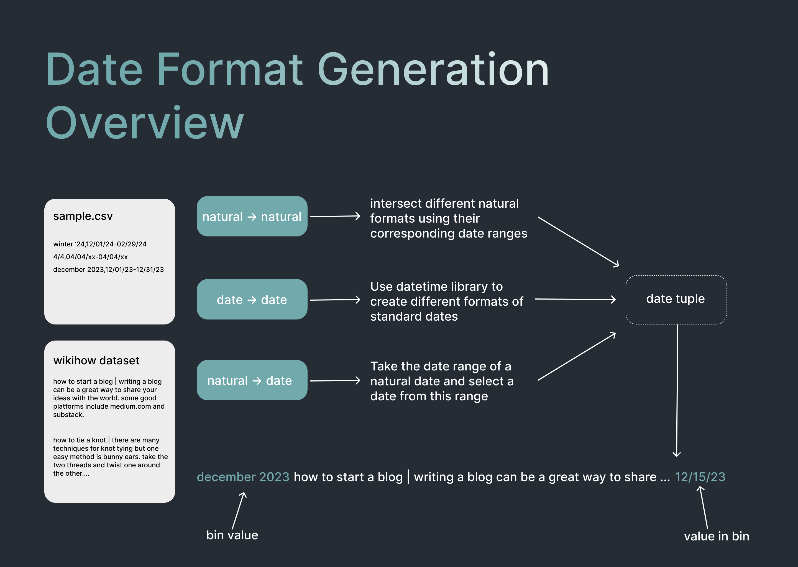
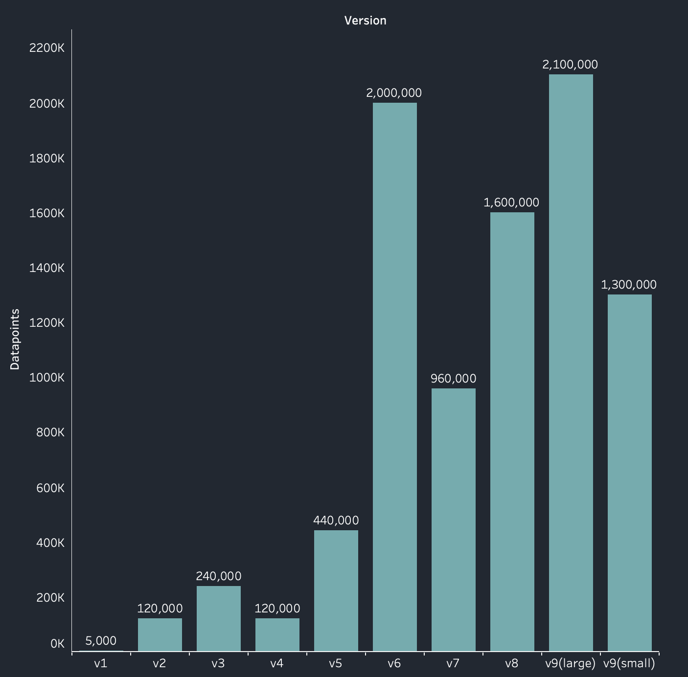
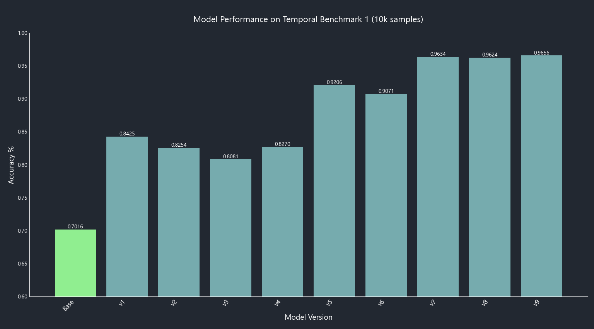
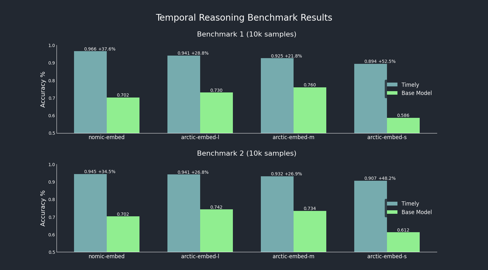

# Technical Report

## **Introduction**

At Khoj, we develop open-source personal AI to simplify how people engage with machines. The RAG component in modern AI systems commonly uses an embedding model to retrieve relevant documents for a user query. This retrieved-context enables accurate and personalized responses. 

However, most of these models struggle with temporal reasoning. For instance, if asked "Where was I last summer?", the model would struggle to understand the framing of that question. It requires us to understand the relativity of time (that 2010 is before 2011), and when summer might be (between May - September). 

When we express dates, we often use shorthands like ‘back in June’, ‘on summer break’, and ‘06/15’; all syntaxes that models don’t presently handle well. As such, your embedding model may not find documents with dates within that specific period. This limitation is significant, given the importance of time and date in language and daily life.

To address this problem, we propose **Timely**, a comprehensive pipeline for date-aware dataset generation, model fine-tuning, and benchmarking. Specifically, our goal is to create models that can:

1. Identify natural language dates in queries and documents better
2. Can handle relative and soft data filters more naturally (e.g. discerning that June is closer than November when talking about Spring).
## **Overview of Embedding Models**

Embedding models work by converting queries and documents into high-dimensional vectors. The similarity between these vectors is then calculated to determine how conceptually related they are. Vectors that are closer together in this high-dimensional space are considered more related, while those further apart are less related or unrelated.

The similarity between vectors can be calculated using the cosine similarity formula:

$similarity = \frac{\vec{A} \cdot \vec{B}}{|\vec{A}| \cdot |\vec{B}|}$

## **Dataset Preparation**

To improve temporal reasoning, we fine-tuned a base embedding model to bring vectors of similar temporal descriptions closer together. This process required generating diverse, high-quality data matching descriptions of dates in various formats.

We started with the [wikihow dataset](https://huggingface.co/datasets/sentence-transformers/wikihow/viewer/pair/train) and augmented query-document pairs with temporal descriptors. For example, a query might be appended with "today:2024-04-01 last spring" and the corresponding document with "spring 2023" or "03/15/2023". We generated various date formats programmatically and included plain WikiHow query-document pairs to prevent overfitting.

## **Training**

We initially used a T4 GPU for training runs and later upgraded to an NVIDIA A100 as our dataset grew beyond 100,000 entries. We primarily used the **nomic-embed-v1** embeddings model but switched to **arctic-embed** models for our final release to offer small, medium, and large model variants.

Training parameters remained largely consistent across iterations, aligning with the [Nomic technical report](https://static.nomic.ai/reports/2024_Nomic_Embed_Text_Technical_Report.pdf):

### nomic-embed-v1 fine-tuning:
- Batch size: 8 or 64 (v5 and upwards)
- Epochs: 1
- Learning rate: 2.0e-5
- Loss function: Multiple negatives ranking loss
- Binary floating point 16
- Warmup ratio: 0.1
- Weight decay: 0.01
- Warmup steps: 400

### arctic-embed fine-tuning:
- Same as above, but with a learning rate of 1.0e-5

Our iterative process focused on improving:
1. Dataset diversity
2. Generalization
3. Dataset size

### **Version History**

We went through multiple iterations, each improving various aspects of the model. Here's a summary of key versions:

- **v0.1 - v0.5**: Gradually increased dataset size and diversity, showing improvements in date matching and natural format recognition.
- **v0.6 - v0.8**: Scaled up to millions of data points, addressed MTEB degradation, and improved performance on diverse benchmarks.
- **v0.9 (version 1)**: Final release with 1.3-2.1M data points, increased diversity, and improved support for relative date formats.

## **Benchmarking**

We created benchmarks using a strategy similar to our dataset generation, with new query-document pairs and various date formats based on unused sentences from the Wikihow dataset and Google answer-question (gooaq) dataset. Our diverse long benchmark (10k samples) evenly distributes different forms of natural language temporal information.

This graph shows that even a small amount of fine-tuning significantly improves performance, with dataset diversity correlating with benchmark performance improvements.

The final benchmark results for our three tiers of Timely models (small, medium, and large) compared to their base models show that all fine-tuned models achieve close to 90% accuracy, with the small model showing the largest performance improvement.

With this in mind, there are some unresolved issues currently. In terms of MTEB scoring, our models currently have a substantial loss in general retrieval abilities compared to the reported scores from the Arctic and Nomic base models. While there are several explanations for this degradation including dataset quality issues, model training differences, and overall concerns about the accuracy of MTEB, a conclusive analysis is required.

## **Findings and Conclusion**

Key insights from our process include:
- Dataset quality is crucial for achieving good performance
- Scaling dataset size without increasing diversity can lead to overfitting and performance degradation
- Consulting technical reports for base embedding models can reveal optimal training parameters

## **Future Work**

Our future focus includes:
- Incorporate smaller natural time formats (e.g. 8 pm, morning, sunrise, sunset)
- Improve dataset quality using synthetic LLM-generated query-document pairings
- Collect and incorporate user feedback from model version 1 to address issues
- Conducting rigorous analysis of overall retrieval degradation to ensure the model can still be used in versatile applications.

# Usage

## Pretrained Models, Benchmarks, Datasets
To download our fine-tuned Timely models visit our huggingface page here: [huggingface]

## Dataset Generation
To replicate dataset generation use the following steps:
1. Run all files ending in "gen.py" (excluding gradientgen, benchgen, and datasetgen) to generate date tuple csv files
2. Run `py date_to_date.py`
3. Run `py natural_to_date.py`
4. Run `py natural_tuples.py` rerunning `lastxgen.py` and `relativedategen.py` with a smaller sample size for improved speed.
5. Run `py datasetgen2.py`. This will create a csv file in datasets titled `datasets/wiki_date_aware_diverse_v4.csv`. Change as necessary
6. Convert this csv file to a .txt file and run it through `dataset_linter.py`
7. The output text file can be used in training.

## Model Training
1. Start a Google Colab Instance with an A100 for optimal speed
2. Upload the desired `.txt` dataset
3. Open the `training.ipynb` notebook.
4. Adjust batch size and other parameters as necessary
5. **IMPORTANT: ** After pip installation, use the command at the end of the notebook to refresh pip installations.
6. Run all other lines starting at the python imports

## Benchmarking
1. Load the desired benchmark and trained model
2. Run all code blocks in `testing.ipynb`

## Questions
For any questions or suggestions feel free to contact team@khoj.dev
